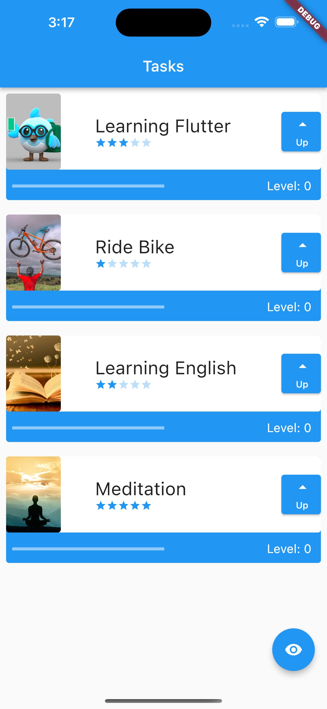

<h1>Flutter: Widgets, Stateless, Stateful, Images and Animations</h1>

Take this Flutter course and:

- Find out what Flutter is and what it's for;
- Learn how to install Android Studio;
- Learn how to install Flutter;
- Create your first project;
- Understand what Widgets are, how to categorize and manipulate them;
- Understand what Stateless and Stateful Widgets are and their differences;
- Learn how to add Animated Images and Widgets to your project;
- See the importance of Refactoring in your project;

Screenshot app: 

Certificate: 'https://cursos.alura.com.br/certificate/c4cdb719-b1fc-4846-a8f8-795c4c68d95f'

